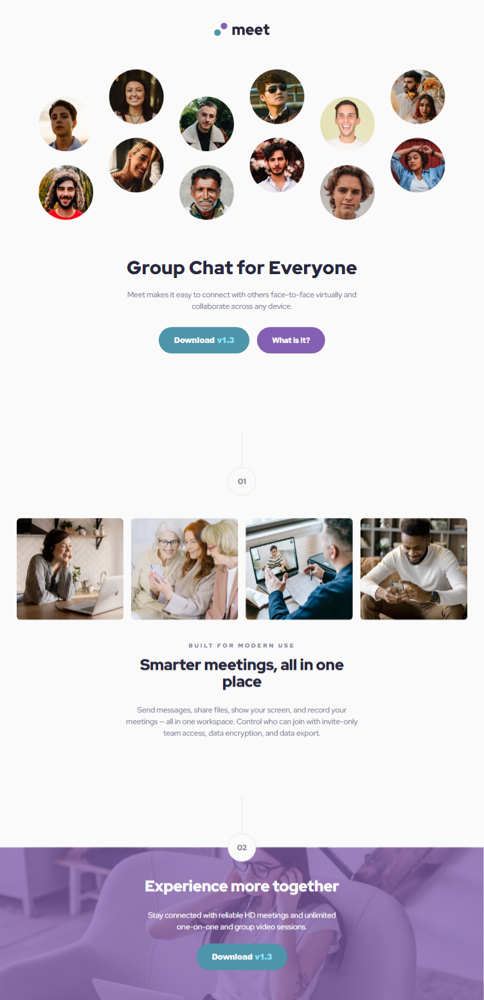
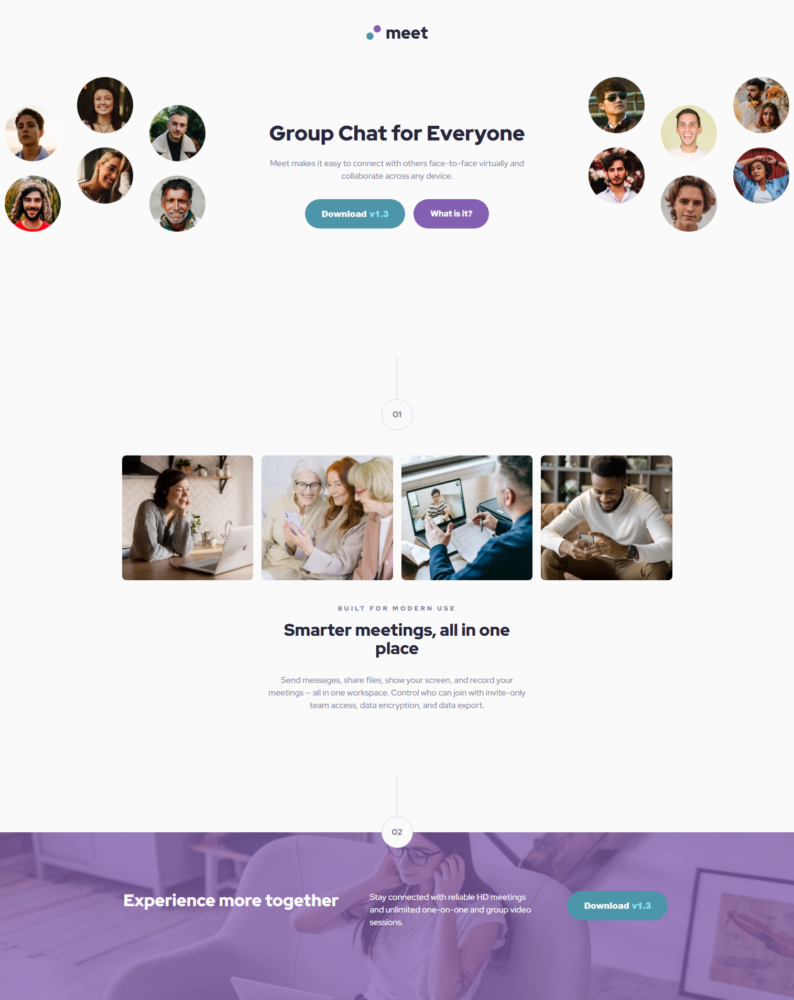

# Meet landing page solution

This is a solution to the [Meet landing page challenge on Frontend Mentor](https://www.frontendmentor.io/challenges/meet-landing-page-rbTDS6OUR). Frontend Mentor challenges help you improve your coding skills by building realistic projects.

## Table of contents

- [Overview](#overview)
  - [The challenge](#the-challenge)
  - [Screenshot](#screenshot)
  - [Links](#links)
- [My process](#my-process)
  - [Built with](#built-with)
  - [What I learned](#what-i-learned)
  - [Useful resources](#useful-resources)
  - [AI Collaboration](#ai-collaboration)
- [Author](#author)

## Overview

### The challenge

Users should be able to:

- View the optimal layout depending on their device's screen size
- See hover states for interactive elements

### Screenshot

#### Mobile view

#### Tablet view

#### Dekstop view

### Links

- Solution URL: [Github repo](https://github.com/simeon2002/FEM-meet-landing-page/)
- Live Site URL: [Meet landing page](https://simeon2002.github.io/FEM-meet-landing-page/)

## My process

### Built with

- Semantic HTML5 markup
- CSS custom properties
- Flexbox
- CSS Grid
- Mobile-first workflow
- responsive images

### Retrospection

- Difficulties encountered?
  - First → The step. I had issues with how to create it due to not wanting to pollute the HTML with visual-only wrappers
    - first try → tried display flex with a paragraph putting a circular border around it but the step number wasn’t in the middle of the circle
    - second try → tried to use before and after pseudo element, but then the spacing between sections would be messed up and calculation would have been counting pixels instead of uniform across the page.
    - **Solution:** Scrapped this and instead used wrappers in the HTML in which the step number was wrapped into a circle, fixing this issue.
  - Secondly → Since I learnt responsiveness starting with desktop-first, I have issues with thinking mobile-first
    - _mainly using the responsive units to set image width and then to set the `max-width` of the container._
    - Also the layouts seem to have more natural change when going from desktop to mobile, now it seems that I am adding so many styles that using utility classes (like `container` and `grid`) is impractical. e.g., on desktop I went from gridcolumns: 4 to 2 for tablet to 1 for mobile and now I have to keep adding these styles to specific sections instead of general utility classes applied.
    - Another problem is that when going from desktop to mobile I could always adjust he max-width when something became too big. I always gave it `max-width` and afterwards padding for when it less than this max-width and then modified the max-width for containers when going down from f.e. 1400px viewport to 1200px viewport and afterwards I only used paddigns for table and mobiles on the `container` for the sections to adjust the width of the sections. Right now, this feels really weird, because just using padding on mobile and tablet and afterward max-width on desktop (like 1000px + veiwport) feels weird…
  - Thirdly → Because of this responsiveness, had issues to make the images scale nicely in the hero section with `max-width`
    - At first I defined the max-width of the hero to `112rem` (1120px) but then they won’t scale responsively since they are already too big for their container, so instead, I defined as `144rem` (1440px) and made them scale as `%` again with this time scaling nicely.
- Questions?
  - Any other way to think about mobile-first…? It feels weird
- What would you do better next time?
  - Set up my grid better to adjust for desktop and use less utility classes in that case
  - Think about the layout a better beforehand, had to make some structural changes (for image element responsiveness especially)
- Learnings/takeaways
  - Learnt how to use the `picture` elmenet with media queries
  - Getting slowly into mobile-first, feeling a bit weird but that’s ok.

### Useful resources

- MDN documentation

## Author

- Frontend Mentor - [@simeon2002](https://www.frontendmentor.io/profile/simeon2002)
- Twitter - [@SimeonSeraf1mov](https://x.com/SimeonSeraf1mov)
